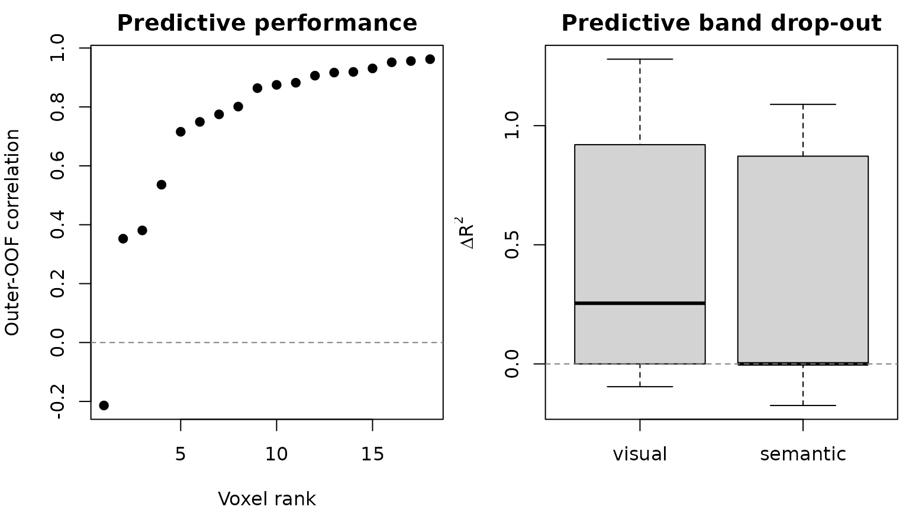

# Fit a Blocked Voxelwise Banded-Ridge Encoding Model

You have several time-aligned feature spaces—for example, visual motion,
audio, and semantic features—and one BOLD response at every voxel. You
want to predict each voxel on observations the model never saw, while
allowing different feature spaces and different voxels to need different
amounts of regularization. Randomly splitting a time series would leak
temporal context, so the validation units must remain intact.

This guide builds that analysis with three contiguous stimulus segments.
By the end, you will have voxelwise outer out-of-fold predictions, MSE,
correlation, R2, the alpha and feature-space weights selected inside
each outer training set, and optional predictive leave-one-band-out
delta R2 maps.

## What are the inputs?

Rows of the predictor matrix must align exactly with volumes in the
image series.
[`blocks()`](https://bbuchsbaum.github.io/rMVPA/reference/blocks.md)
receives **numbers of columns**, not column indices. The design owns
both feature-band membership and the training block metadata, so the
model cannot receive a second, conflicting band specification.

``` r

features <- feature_sets(
  example$X,
  blocks(visual = 4, semantic = 4)
)

design <- feature_sets_design(
  features,
  block_var_train = example$blocks,
  time_series = TRUE
)
```

The example has 36 observations, eight predictors in two named bands,
three independent temporal segments, and 18 active voxels.

| observations | predictors | feature_bands | temporal_blocks | active_voxels |
|-------------:|-----------:|--------------:|----------------:|--------------:|
|           36 |          8 |             2 |               3 |            18 |

Aligned inputs for the worked example. {.table}

## How do you fit the model safely?

The outer folds estimate generalization. The inner folds choose
hyperparameters using only the corresponding outer-training rows.
Because the design declares a time series, rMVPA refuses an unsafe
random split unless you provide intact blocks or an explicit temporal
purge.

``` r

model <- banded_ridge_model(
  example$dataset, design,
  outer_crossval = 3, tune_crossval = 2,
  theta_method = "grid", theta_grid_points = 3,
  target_batch_size = 7, return_predictions = TRUE,
  delta_sets = "all"
)

result <- run_banded_ridge(model)
```

`alphas` is left at its default, `"auto"`, which places nine penalties
across six decades around the scale at which the penalty starts to
change this design’s fit. That scale is a property of the design, not a
constant: the solver standardizes every training column and scales band
`b` by `sqrt(theta_b)`, so alpha competes with cross-product eigenvalues
that average `(n - 1) * mean(D_b) / min(n - 1, p)`. It grows with the
number of rows and with band width, which is why a design with a few
thousand timepoints needs penalties orders of magnitude larger than one
with a few dozen.

``` r

signif(model$alpha_grid, 3)
#> [1] 1.75e-02 9.84e-02 5.53e-01 3.11e+00 1.75e+01 9.84e+01 5.53e+02 3.11e+03
#> [9] 1.75e+04
```

`outer_crossval` also accepts a `cross_validation` object, so
`blocked_cross_validation(example$blocks)` selects the same block-wise
outer folds used elsewhere in rMVPA. Integer counts and
`cross_validation` objects have `purge` applied to their training rows,
whereas a hand-built fold list is validated as supplied. `tune_crossval`
can be omitted: the default uses at most five inner folds, limited by
the blocks (or rows, when none are declared) available inside each
outer-training set, and inner tuning is skipped entirely when only one
candidate survives the alpha/theta scopes.

The compact result table is already in original voxel order. These are
pooled outer out-of-fold metrics: every observation contributes once,
from the outer fold in which it was held out.

``` r

head(result$metrics)
#>   voxel_index response n_obs       mse correlation        r2
#> 1           1  voxel_1    36 0.4212985   0.9188365 0.8425157
#> 2           2  voxel_2    36 0.3902411   0.9558373 0.9133813
#> 3           3  voxel_3    36 0.3619358   0.9620976 0.9256266
#> 4           4  voxel_4    36 0.5749462   0.7747922 0.5937547
#> 5           5  voxel_5    36 0.5011491   0.5359127 0.2762339
#> 6           6  voxel_6    36 0.3534999   0.9166569 0.8398795
```

The hyperparameter table is deliberately fold-specific. A single
averaged alpha or theta map is convenient for visualization, but this
table is the exact record of what generated each fold’s predictions.

``` r

head(result$hyperparameters[, c(
  "voxel_index", "outer_fold", "alpha",
  "theta_visual", "theta_semantic", "inner_score"
)])
#>   voxel_index outer_fold      alpha theta_visual theta_semantic inner_score
#> 1           1     fold_1 0.09840973          0.5            0.5   0.5676847
#> 2           1     fold_2 0.09840973          1.0            0.0   0.2934400
#> 3           1     fold_3 0.55339859          1.0            0.0   0.5994161
#> 4           2     fold_1 0.09840973          1.0            0.0   0.5679984
#> 5           2     fold_2 0.01750000          1.0            0.0   0.5735952
#> 6           2     fold_3 0.55339859          1.0            0.0   0.3304154
```



Positive and negative values are both meaningful. A negative delta means
the independently retuned reduced model predicted better in these finite
samples; the value is never clipped.

## Did the tuning grid contain the optimum?

A tuning grid that stops short of the optimum does not fail. Every
response simply takes the largest penalty on offer, the refit is
under-penalized, and the maps and delta R2 values come back fully
populated and wrong. Read `result$selection_diagnostics` before anything
else.

``` r

result$selection_diagnostics$alpha[, c(
  "model", "modal_alpha", "share_at_grid_min", "share_at_grid_max",
  "share_interior", "saturated"
)]
#>              model  modal_alpha share_at_grid_min share_at_grid_max
#> 1             full 5.533986e-01        0.14814815         0.0000000
#> 2   without_visual 1.750000e+04        0.09259259         0.3148148
#> 3 without_semantic 3.111989e+00        0.09259259         0.2222222
#>   share_interior saturated
#> 1      0.8518519     FALSE
#> 2      0.5925926     FALSE
#> 3      0.6851852     FALSE
```

The signature of a usable grid is an **interior** modal selection: most
responses chose an alpha that is neither the smallest nor the largest
available, so the grid brackets the optimum rather than truncating it.
`saturated` is set when 95% of a model’s selections take one end of the
grid, or when the two ends hold 95% between them, and
[`run_banded_ridge()`](https://bbuchsbaum.github.io/rMVPA/reference/run_banded_ridge.md)
warns. Both forms matter. Alpha is tuned per response by default, so a
mask that mixes predictable voxels with unpredictable ones sends its
boundary mass to opposite ends — the noise voxels want more penalty than
the ceiling offers, the signal voxels less than the floor — and neither
end alone need look alarming while almost nothing lands inside. Widen
`alphas` until the modal selection moves inside.

`$fit` answers the second question, which is independent of the grid:
did the model predict at all?

``` r

result$selection_diagnostics$fit
#>              model n_responses n_scored  median_r2   mean_r2 share_r2_positive
#> 1             full          18       18  0.7527416 0.6054574         0.9444444
#> 2   without_visual          18       18 -0.0218104 0.1722848         0.3333333
#> 3 without_semantic          18       18  0.2720315 0.3170440         0.6666667
```

A median outer out-of-fold R2 below `-0.05` means the fit predicts worse
than the mean of the data it was scored on, and
[`run_banded_ridge()`](https://bbuchsbaum.github.io/rMVPA/reference/run_banded_ridge.md)
warns about that separately. Nothing downstream of such a fit describes
explained variance — in particular, the leave-one-band-out deltas are
then differences between two models that both fail.

## Which loss and which score are you reading?

Three quantities answer different questions:

1.  `inner_score` is the selection loss. The default is MSE computed
    from inner out-of-fold predictions within one outer-training set.
    Correlation and R2 are explicit opt-in selection criteria.
2.  `mse`, `correlation`, and `r2` in `result$metrics` are descriptive
    scores computed after concatenating the outer out-of-fold
    predictions. They are not the inner selection scores.
3.  `delta_cv_r2_<band>` is `R2_full - R2_without_band`, using the same
    outer test rows for both models. Each reduced model is tuned again.
    This is a predictive leave-one-band-out effect, not an additive
    unique/shared variance decomposition, so effects need not sum to the
    full-model R2.

The fitted objective for a fixed candidate is

``` math
  \widehat B = \arg\min_B
  \lVert Y - XB \rVert_F^2 +
  \sum_g \frac{\alpha}{\theta_g}\lVert B_g \rVert_F^2,
```

where non-negative theta values sum to one. `theta_g = 0` excludes a
band exactly. The squared-error term is not divided by the number of
observations, so alpha is on the scale of the training cross-product.
Centering and scaling are learned separately inside every training
split. Equal theta values recover ordinary ridge after accounting for
scale: with `G` bands and ordinary ridge penalty `lambda`, use
`theta_g = 1/G` and `alpha = lambda/G`.

## What is retained, and what can become large?

The constructor resolves the solver and estimates retained output
storage before fitting. The default keeps metrics and hyperparameters
but not the full prediction matrix, coefficients, or nested diagnostics.
Request those outputs only when you need them.

| chosen_solver | reason | predictions_MiB | attribution_MiB | total_retained_MiB |
|:---|:---|---:|---:|---:|
| direct | measured small-p direct threshold p \<= 64 and storage fits | 0.0148 | 0.0074 | 0.0222 |

Decision and retained-storage estimate available before fitting.
{.table}

Use `weight_retention = "primal"` for outer-fold coefficient matrices or
`"dual"` for outer-fold sample-space weights. `max_retained_mb` refuses
an unsafe request before allocation; `weight_overflow = "none"` may
explicitly fall back to no weights. `memory_limit_mb` independently
guards solver intermediates and caps the retained decomposition cache:
band Gram matrices are cached once per training split and shared across
theta candidates and drop-out models, and least-recently-used entries
are evicted (and recomputed on demand) once the cap is reached, so the
limit changes reuse but never results. Runtime provenance records the
chosen solver, chunk manifest, decomposition, band-Gram reuse, and
eviction counts, maximum chunk result size, and the B+1 cost of
requested drop-out models.

For `F` outer folds, `K` inner folds, `T` theta candidates, `A` alphas,
and response chunks of size `B`, tuning evaluates approximately
`F * K * T * A` candidate fits per conceptual model and then performs
outer refits. Optimized paths reuse a decomposition across alpha values
only when the training rows and theta are unchanged. Changing theta
changes the scaled design/kernel and requires another decomposition;
there is no claim of one decomposition for the entire search.

## What did the issue \#70 simulation show when rerun?

Issue \#70 reported a large relative gain from per-voxel penalties in
one simulation. The reproducibility script installed at
`benchmarks/banded_ridge_issue70.R` defines a concrete successor: two
bands, 40 voxels at SNR 1.0/0.4/0.0, six contiguous outer segments,
nested tuning, and 30 declared seeds. It compares shared alpha/theta
with response-specific alpha/theta and reports the **absolute**
OOF-correlation change.

|     | SNR | shared_r | response_specific_r | absolute_gain | gain_q025 | gain_q975 |
|:----|----:|---------:|--------------------:|--------------:|----------:|----------:|
| 0   | 0.0 |   -0.014 |              -0.023 |        -0.010 |    -0.080 |     0.047 |
| 0.4 | 0.4 |    0.269 |               0.222 |        -0.048 |    -0.069 |    -0.030 |
| 1   | 1.0 |    0.599 |               0.589 |        -0.010 |    -0.025 |     0.015 |

Issue \#70 successor simulation. Intervals are empirical 2.5% and 97.5%
quantiles of replication-level mean absolute gains. {.table}

This registered variant did **not** reproduce the earlier 78% claim. At
SNR 0.4, response-specific tuning changed OOF correlation by about
-0.048 in absolute units (replication interval about -0.069 to -0.030).
The result is specific to this data-generating process, MSE selection
rule, and candidate grid; it is neither evidence that shared tuning is
universally better nor a correctness test. Across pure-noise voxels, the
replication-level mean response-specific correlation was close to zero
(about -0.023; empirical 95% interval about -0.092 to 0.013). The
direct/SVD/dual oracles, leakage mutations, and attribution adversaries
provide correctness evidence instead.

## How does this relate to other ridge tools?

Choose by estimand and execution environment, then compare on identical
folds, preprocessing, candidate sets, and response scoring.

| Tool | Useful when | Important comparison boundary |
|----|----|----|
| Ordinary ridge | One common penalty across all feature columns is the scientific model | In rMVPA, use fixed equal theta and convert ordinary `lambda` to `alpha = lambda/G` |
| [glmnet](https://cran.r-project.org/package=glmnet) | You need elastic-net/lasso paths or its established sparse-matrix tooling | `mgaussian` is a multi-task group penalty across responses; its objective scaling and standardization conventions differ |
| [multiridge](https://cran.r-project.org/package=multiridge) | You want its multi-penalty CV or marginal-likelihood workflows for high-dimensional data blocks | Its optimization, preprocessing, and response model are not assumed to be numerically identical to this nested voxelwise estimand |
| [himalaya](https://gallantlab.org/himalaya/) | You want Python, CPU/GPU backends, or multiple-kernel/group-ridge solvers at very large target counts | It is an external parity target, not an rMVPA dependency; align folds, centering, alpha/theta parameterization, and precision before comparing |

The bundled fixed-shape performance receipt likewise characterizes,
rather than proves superiority. On the recorded Apple M3 Max / R 4.5.1
run, the `n = 60, p = 512, V = 12` public workflow took median 0.226
seconds with the direct backend and 0.099 seconds with each optimized
backend over five runs. The solver planner estimated 2.15 MB, 0.33 MB,
and 0.17 MB of intermediate storage respectively. Wall times are tracked
as snapshots; CI enforces structural shape, batching, allocation, cache,
and numerical-parity contracts instead of brittle timing cutoffs.

## Where should you go next?

Use
[`?banded_ridge_model`](https://bbuchsbaum.github.io/rMVPA/reference/banded_ridge_model.md)
for the complete objective, candidate, storage, and failure contracts;
[`?run_banded_ridge`](https://bbuchsbaum.github.io/rMVPA/reference/run_banded_ridge.md)
for the result schema and regional batching rules; and
[`vignette("CrossValidation")`](https://bbuchsbaum.github.io/rMVPA/articles/CrossValidation.md)
for broader validation design. For temporally ordered data, decide the
independent blocks or purge from the acquisition and stimulus design
before choosing a solver.
