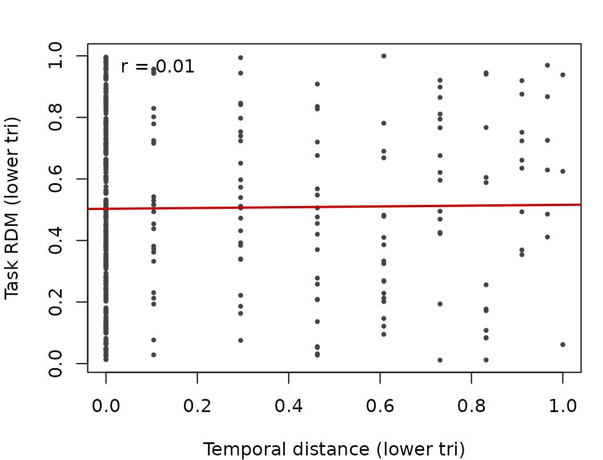
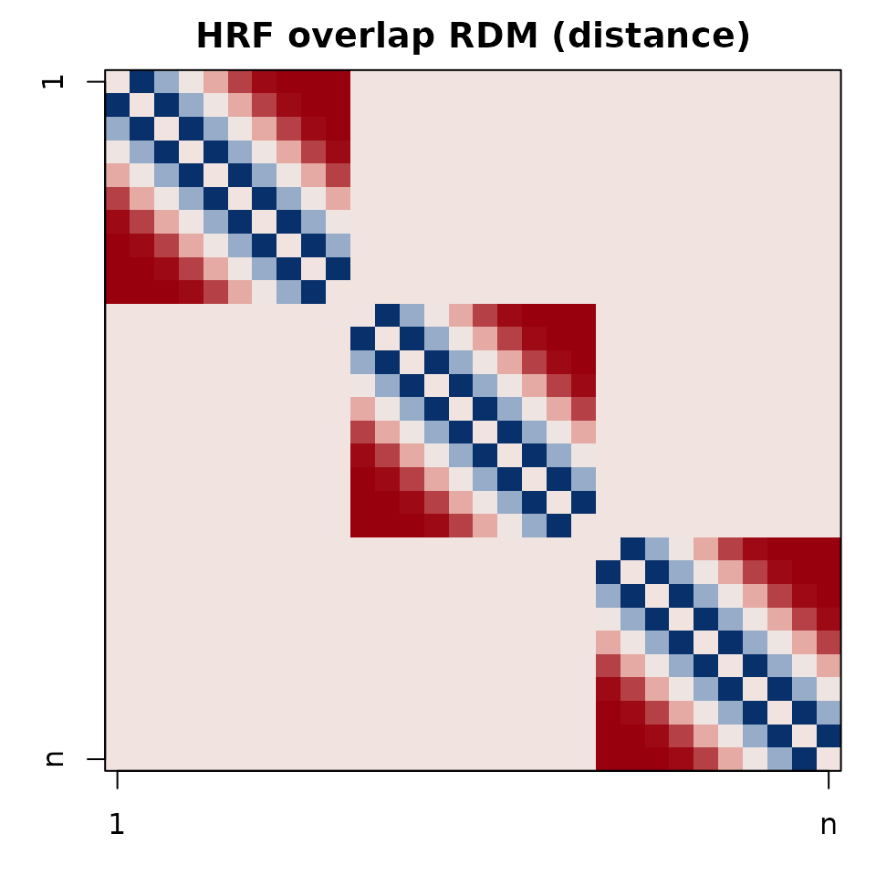
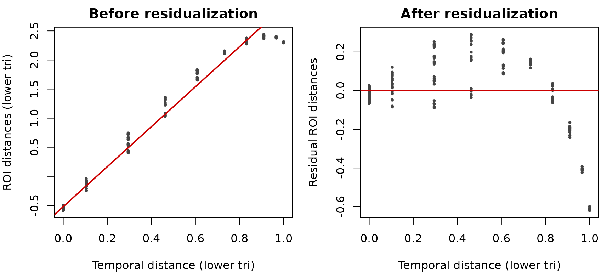

# Temporal Confounds in RSA

## Introduction

Temporal proximity can induce similarity between trial patterns
(adaptation, drift, HRF overlap). This vignette shows how to add
temporal nuisance RDMs to RSA and MS-ReVE designs using convenience
functions.

## Trial-level temporal RDMs

``` r
set.seed(1)
n <- 30
onsets <- seq(0, by=1, length.out=n)  # seconds
runs <- rep(1:3, each=10)

# Exponential decay, returned as distance
td <- temporal_rdm(onsets, block = runs, units = "sec", TR = 0.8,
                   kernel = "exp", metric = "distance")
td
```

           1     2     3     4     5     6     7     8     9    10    11    12
    2   14.0                                                                  
    3   39.5  14.0                                                            
    4   62.0  39.5  14.0                                                      
    5   81.5  62.0  39.5  14.0                                                
    6   98.0  81.5  62.0  39.5  14.0                                          
    7  111.5  98.0  81.5  62.0  39.5  14.0                                    
    8  122.0 111.5  98.0  81.5  62.0  39.5  14.0                              
    9  129.5 122.0 111.5  98.0  81.5  62.0  39.5  14.0                        
    10 134.0 129.5 122.0 111.5  98.0  81.5  62.0  39.5  14.0                  
    11   0.0   0.0   0.0   0.0   0.0   0.0   0.0   0.0   0.0   0.0            
    12   0.0   0.0   0.0   0.0   0.0   0.0   0.0   0.0   0.0   0.0  14.0      
    13   0.0   0.0   0.0   0.0   0.0   0.0   0.0   0.0   0.0   0.0  39.5  14.0
    14   0.0   0.0   0.0   0.0   0.0   0.0   0.0   0.0   0.0   0.0  62.0  39.5
    15   0.0   0.0   0.0   0.0   0.0   0.0   0.0   0.0   0.0   0.0  81.5  62.0
    16   0.0   0.0   0.0   0.0   0.0   0.0   0.0   0.0   0.0   0.0  98.0  81.5
    17   0.0   0.0   0.0   0.0   0.0   0.0   0.0   0.0   0.0   0.0 111.5  98.0
    18   0.0   0.0   0.0   0.0   0.0   0.0   0.0   0.0   0.0   0.0 122.0 111.5
    19   0.0   0.0   0.0   0.0   0.0   0.0   0.0   0.0   0.0   0.0 129.5 122.0
    20   0.0   0.0   0.0   0.0   0.0   0.0   0.0   0.0   0.0   0.0 134.0 129.5
    21   0.0   0.0   0.0   0.0   0.0   0.0   0.0   0.0   0.0   0.0   0.0   0.0
    22   0.0   0.0   0.0   0.0   0.0   0.0   0.0   0.0   0.0   0.0   0.0   0.0
    23   0.0   0.0   0.0   0.0   0.0   0.0   0.0   0.0   0.0   0.0   0.0   0.0
    24   0.0   0.0   0.0   0.0   0.0   0.0   0.0   0.0   0.0   0.0   0.0   0.0
    25   0.0   0.0   0.0   0.0   0.0   0.0   0.0   0.0   0.0   0.0   0.0   0.0
    26   0.0   0.0   0.0   0.0   0.0   0.0   0.0   0.0   0.0   0.0   0.0   0.0
    27   0.0   0.0   0.0   0.0   0.0   0.0   0.0   0.0   0.0   0.0   0.0   0.0
    28   0.0   0.0   0.0   0.0   0.0   0.0   0.0   0.0   0.0   0.0   0.0   0.0
    29   0.0   0.0   0.0   0.0   0.0   0.0   0.0   0.0   0.0   0.0   0.0   0.0
    30   0.0   0.0   0.0   0.0   0.0   0.0   0.0   0.0   0.0   0.0   0.0   0.0
          13    14    15    16    17    18    19    20    21    22    23    24
    2                                                                         
    3                                                                         
    4                                                                         
    5                                                                         
    6                                                                         
    7                                                                         
    8                                                                         
    9                                                                         
    10                                                                        
    11                                                                        
    12                                                                        
    13                                                                        
    14  14.0                                                                  
    15  39.5  14.0                                                            
    16  62.0  39.5  14.0                                                      
    17  81.5  62.0  39.5  14.0                                                
    18  98.0  81.5  62.0  39.5  14.0                                          
    19 111.5  98.0  81.5  62.0  39.5  14.0                                    
    20 122.0 111.5  98.0  81.5  62.0  39.5  14.0                              
    21   0.0   0.0   0.0   0.0   0.0   0.0   0.0   0.0                        
    22   0.0   0.0   0.0   0.0   0.0   0.0   0.0   0.0  14.0                  
    23   0.0   0.0   0.0   0.0   0.0   0.0   0.0   0.0  39.5  14.0            
    24   0.0   0.0   0.0   0.0   0.0   0.0   0.0   0.0  62.0  39.5  14.0      
    25   0.0   0.0   0.0   0.0   0.0   0.0   0.0   0.0  81.5  62.0  39.5  14.0
    26   0.0   0.0   0.0   0.0   0.0   0.0   0.0   0.0  98.0  81.5  62.0  39.5
    27   0.0   0.0   0.0   0.0   0.0   0.0   0.0   0.0 111.5  98.0  81.5  62.0
    28   0.0   0.0   0.0   0.0   0.0   0.0   0.0   0.0 122.0 111.5  98.0  81.5
    29   0.0   0.0   0.0   0.0   0.0   0.0   0.0   0.0 129.5 122.0 111.5  98.0
    30   0.0   0.0   0.0   0.0   0.0   0.0   0.0   0.0 134.0 129.5 122.0 111.5
          25    26    27    28    29
    2                               
    3                               
    4                               
    5                               
    6                               
    7                               
    8                               
    9                               
    10                              
    11                              
    12                              
    13                              
    14                              
    15                              
    16                              
    17                              
    18                              
    19                              
    20                              
    21                              
    22                              
    23                              
    24                              
    25                              
    26  14.0                        
    27  39.5  14.0                  
    28  62.0  39.5  14.0            
    29  81.5  62.0  39.5  14.0      
    30  98.0  81.5  62.0  39.5  14.0

``` r
# Matrix for plotting
td_mat  <- as.matrix(td)
mn      <- min(td_mat[lower.tri(td_mat)], na.rm = TRUE)
mx      <- max(td_mat[lower.tri(td_mat)], na.rm = TRUE)
td_plot <- if (is.finite(mx - mn) && (mx - mn) > 0) (td_mat - mn) / (mx - mn) else td_mat * 0
```

## Visualizing temporal RDMs

``` r
op <- par(mar=c(3,3,2,1))
image(t(td_plot[nrow(td_plot):1, ]), axes=FALSE, col=cols(64))
box(); title("Temporal RDM (exp kernel)")
axis(1, at=c(0,1), labels=c("1","n")); axis(2, at=c(0,1), labels=c("n","1"))
```


``` r
invisible(par(op))
```

## Using in rsa_design

``` r
task_rdm <- as.dist(matrix(stats::runif(n*n), n, n))
rtemp <- temporal(onsets, block = runs, kernel = "exp")
rdes <- rsa_design(~ task_rdm + rtemp,
                   data=list(task_rdm=task_rdm, rtemp=rtemp, onsets=onsets, runs=runs),
                   block_var=~ runs, keep_intra_run=TRUE)
print(rdes)
```

    \n RSA Design \n- - - - - - - - - - - - - - - - - - - - \n\nFormula:\n  |-  ~task_rdm + rtemp \n\nVariables:\n  |- Total Variables:  4 \n  |- task_rdm: distance matrix\n  |- rtemp: distance matrix\n  |- onsets: vector\n  |- runs: vector\n\nStructure:\n  |- Blocking: Present\n  |- Number of Blocks:  3 \n  |- Block Sizes:  1: 10, 2: 10, 3: 10 \n  |- Comparisons: All included\n\n

## Assessing overlap with a task RDM

``` r
task_mat <- as.matrix(task_rdm)
tvec <- lower_tri(td_plot)
avec <- lower_tri(task_mat)
op <- par(mar=c(4,4,2,1))
plot(tvec, avec, pch=16, cex=.6, col="#444444",
     xlab="Temporal distance (lower tri)", ylab="Task RDM (lower tri)")
abline(lm(avec ~ tvec), col="#cc0000", lwd=2)
legend("topleft", bty="n",
       legend=sprintf("r = %.2f", stats::cor(tvec, avec)))
```



``` r
invisible(par(op))
```

## HRF-overlap confound

``` r
hrf_rdm <- temporal_hrf_overlap(onsets, durations=rep(1, n), run=runs,
                                TR=0.8, similarity="overlap", metric="distance")
hrf_mat <- as.matrix(hrf_rdm)

# Stretch dynamic range for plotting (rescale to 0..1 over lower-tri)
rng <- range(hrf_mat[lower.tri(hrf_mat)], na.rm = TRUE)
hrf_plot <- if (is.finite(diff(rng)) && diff(rng) > 0) (hrf_mat - rng[1]) / diff(rng) else hrf_mat * 0

op <- par(mar=c(3,3,2,1))
image(t(hrf_plot[nrow(hrf_plot):1, ]), axes=FALSE, col=cols(64))
box(); title("HRF overlap RDM (distance)")
axis(1, at=c(0,1), labels=c("1","n")); axis(2, at=c(0,1), labels=c("n","1"))
```



``` r
invisible(par(op))
```

## Multiple confounds at once

``` r
spec <- list(adj=list(kernel="adjacent", width=1),
             exp3=list(kernel="exp", lambda=3),
             hrf=list(kind="hrf", TR=0.8))
tc <- temporal_confounds(spec, onsets, run=runs, units="sec", TR=0.8)
str(tc)
```

    List of 3
     $ adj : 'dist' num [1:435] 14 81.5 81.5 81.5 81.5 81.5 81.5 81.5 81.5 0 ...
      ..- attr(*, "Size")= int 30
      ..- attr(*, "call")= language temporal_rdm(index = onsets, block = run, kernel = item$kernel %||% "exp",      width = item$width %||% 1L, power| __truncated__ ...
      ..- attr(*, "method")= chr "temporal:adjacent:distance"
     $ exp3: 'dist' num [1:435] 14 39.5 62 81.5 98 ...
      ..- attr(*, "Size")= int 30
      ..- attr(*, "call")= language temporal_rdm(index = onsets, block = run, kernel = item$kernel %||% "exp",      width = item$width %||% 1L, power| __truncated__ ...
      ..- attr(*, "method")= chr "temporal:exp:distance"
     $ hrf : 'dist' num [1:435] 27 50.5 72 90 104 115 124 131 135 0 ...
      ..- attr(*, "Size")= int 30
      ..- attr(*, "call")= language temporal_hrf_overlap(onsets = onsets, durations = item$durations %||% NULL,      run = run, TR = item$TR %||% TR,| __truncated__ ...
      ..- attr(*, "method")= chr "temporal_hrf:spm:overlap:distance"

``` r
op <- par(mfrow=c(1,3), mar=c(3,3,2,1))
for (nm in names(tc)) {
  M <- as.matrix(tc[[nm]])
  image(t(M[nrow(M):1, ]), axes=FALSE, col=cols(64))
  box(); title(paste("confound:", nm))
}
```


``` r
invisible(par(op))
```

## Condition-level nuisances for MS-ReVE

``` r
df <- data.frame(cond = factor(rep(letters[1:3], each=10)), run=runs)
mvdes <- mvpa_design(df, y_train=~cond, block_var=~run)

# Single nuisance via kernel
Ktemp <- temporal_nuisance_for_msreve(mvpa_design=mvdes,
                                      time_idx=seq_len(nrow(df)),
                                      kernel="exp", units="index",
                                      metric="distance")

# Multiple nuisances from a spec (kernel + HRF)
ms_spec <- list(expk=list(kernel="exp", lambda=2), hrf=list(kind="hrf", TR=0.8))
ms_tc <- msreve_temporal_confounds(mvpa_design=mvdes,
                                   time_idx=seq_len(nrow(df)), spec=ms_spec)
str(ms_tc)
```

    List of 2
     $ expk: num [1:3, 1:3] 0 0 0 0 0 0 0 0 0
     $ hrf : num [1:3, 1:3] 0 0 0 0 0 0 0 0 0
      ..- attr(*, "dimnames")=List of 2
      .. ..$ : chr [1:3] "a" "b" "c"
      .. ..$ : chr [1:3] "a" "b" "c"

## Recommendations

- Prefer within_blocks_only=TRUE for trial-level designs unless
  cross-run timing is meaningful.
- Use rank normalization for robust nuisance regressors.
- HRF overlap is most relevant when events are dense and durations \> 0.

## Appendix: Residualizing a toy RDM

``` r
# Simulate a toy ROI RDM as a mixture of task + temporal + noise
toy_roi <- scale(0.6 * task_mat + 0.3 * td_mat + matrix(rnorm(n*n, sd=.1), n, n))
diag(toy_roi) <- 0; toy_roi <- (toy_roi + t(toy_roi))/2

# Correlation before residualization
v_roi  <- lower_tri(toy_roi)
v_temp <- tvec
cat(sprintf("Before residualization: cor(ROI, temporal) = %.2f\n", stats::cor(v_roi, v_temp)))
```

    Before residualization: cor(ROI, temporal) = 0.99

``` r
# Residualize ROI distances on temporal distances
resid_roi <- stats::lm(v_roi ~ v_temp)$residuals
cat(sprintf("After residualization:  cor(resid ROI, temporal) = %.2f\n", stats::cor(resid_roi, v_temp)))
```

    After residualization:  cor(resid ROI, temporal) = -0.00

``` r
# Visualize effect
op <- par(mfrow=c(1,2), mar=c(4,4,2,1))
plot(v_temp, v_roi, pch=16, cex=.6, col="#444444",
     xlab="Temporal distance (lower tri)", ylab="ROI distances (lower tri)",
     main="Before residualization")
abline(lm(v_roi ~ v_temp), col="#cc0000", lwd=2)

plot(v_temp, resid_roi, pch=16, cex=.6, col="#444444",
     xlab="Temporal distance (lower tri)", ylab="Residual ROI distances",
     main="After residualization")
abline(h=0, col="#cc0000", lwd=2)
```



``` r
invisible(par(op))
```
